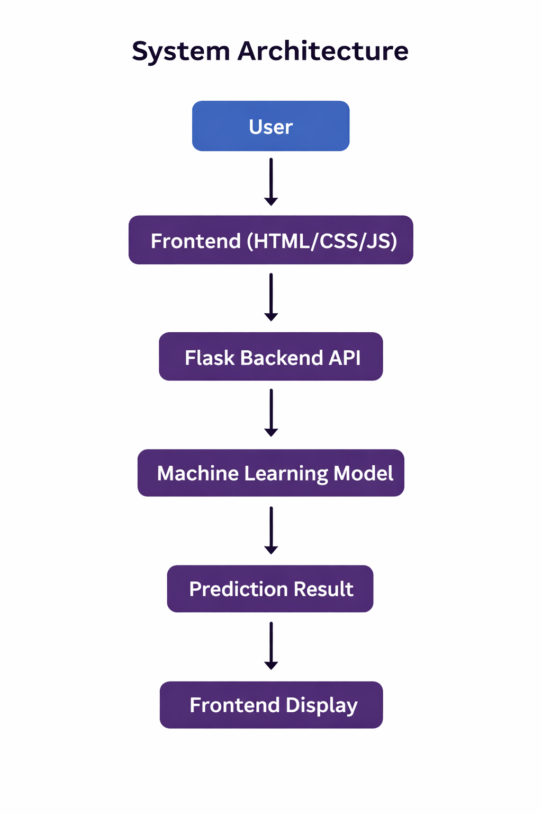

# AI Student Dropout Risk Predictor

## Live Website

https://ai-student-dropout-risk-predictor.onrender.com

## About the Project

## System Architecture

This project predicts the dropout risk of students using an AI model.

The system analyzes:

* Attendance
* Study Hours
* Assignment Completion
* GPA
* Class Participation

Based on these inputs the system predicts:

* LOW RISK
* MODERATE RISK
* HIGH RISK

## Technologies Used

Python
Flask
Scikit-Learn
HTML
CSS
JavaScript

## How to Run the Project

Install dependencies:

pip install -r requirements.txt

Run the server:

python app.py

Open browser:

http://127.0.0.1:5000

## Dataset

The model was trained on a dataset of **20,000 student records**.

## License

MIT License
